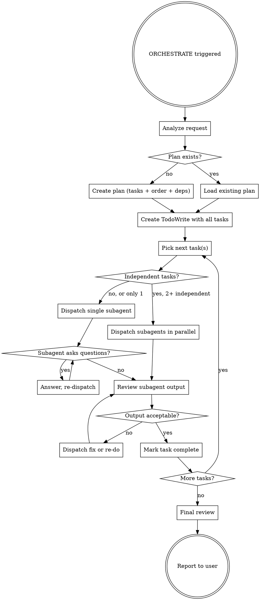

# ORCHESTRATOR Protocol

## TRIGGER

User explicitly requests: **"ORCHESTRATE"** (or **"ORCHESTRATOR"**)

## ACTIVATION

When triggered, switch to orchestration mode: you become a coordinator who plans, delegates, and reviews — but does NOT implement directly. All implementation is dispatched to subagents.

Suspend normal "execute first" behavior. In this mode you plan first, delegate always.

## CORE PRINCIPLE

**You plan, delegate, and review. Subagents implement.**

```
Orchestrator = Brain (planning, routing, reviewing)
Subagents    = Hands (implementing, testing, fixing)
```

## AVAILABLE AGENTS

| Agent       | Model               | Use For                                                              |
| ----------- | ------------------- | -------------------------------------------------------------------- |
| `agent_gpt` | GPT-5.3-codex       | Default choice. Complex logic, multi-file changes, architecture work |
| `agent_glm` | GLM-5.1             | Complex reasoning, architectural tasks, second opinion, fallback     |

### Agent Selection Rules

1. **Default to `agent_gpt`** — GPT-5.3-codex, most capable for implementation
2. **Use `agent_glm`** as fallback if `agent_gpt` fails or for a second opinion on complex problems
3. **Use `agent_glm` for spec and code review** — cross-model review catches more issues

## ULTRATHINK TOGGLE

Prepend `ULTRATHINK` to any subagent prompt to activate deep reasoning mode in that subagent. This costs more tokens but produces better results.

**When to activate ULTRATHINK for a subagent:**

- Task involves complex architectural decisions
- Task requires understanding subtle edge cases
- Task has ambiguous requirements needing interpretation
- Previous attempt by subagent failed or was insufficient
- Task is a critical path item where mistakes are expensive

**When NOT to use ULTRATHINK:**

- Mechanical/boilerplate tasks
- Clear, well-specified single-file changes
- Tasks where the plan already provides complete code

**Syntax in subagent prompt:**

```
ULTRATHINK

You are implementing Task N: [task name]
...
```

## THE ORCHESTRATION PROCESS



## STEP 1: ANALYZE AND PLAN

When ORCHESTRATE is triggered:

1. **Understand the goal** — What does the user want built/fixed/changed?
2. **Survey the codebase** — Use explore agents or read files to understand current state
3. **Decompose into tasks** — Break work into discrete, ordered units
4. **Identify dependencies** — Which tasks block others? Which are independent?
5. **Assign agent types** — Route each task to the right agent tier
6. **Flag ULTRATHINK candidates** — Mark complex tasks that need deep reasoning
7. **Create TodoWrite** — Full task list with status tracking

### Plan Format

Present the plan to the user before executing:

```
## Orchestration Plan

**Goal:** [one sentence]

| #  | Task                  | Agent          | ULTRATHINK | Depends On | Status  |
| -- | --------------------- | -------------- | ---------- | ---------- | ------- |
| 1  | Set up data models      | agent_gpt   | yes        | —          | pending |
| 2  | Write API endpoints     | agent_gpt   | no         | 1          | pending |
| 3  | Add input validation    | agent_gpt   | no         | 2          | pending |
| 4  | Write integration tests | agent_gpt   | yes        | 2          | pending |
| 5  | Update README           | agent_glm   | no         | 1,2        | pending |

Tasks 4 and 5 can run in parallel after task 2 completes.

Proceed?
```

**Wait for user confirmation before executing** unless the user said "just do it" or similar.

## STEP 2: DISPATCH SUBAGENTS

### Single Task Dispatch

```
Task tool (agent_gpt):
  description: "Task N: [name]"
  prompt: |
    [ULTRATHINK — if flagged]

    You are implementing Task N: [task name]

    ## Task Description
    [Full description — don't make subagent search for context]

    ## Context
    [Where this fits, what was done before, architectural decisions]

    ## Constraints
    - Work in: [directory]
    - Don't modify: [protected files/areas]
    - Follow existing patterns in: [reference files]

    ## Expected Output
    - What to implement
    - What to test
    - What to commit

    ## Report Back
    - What you implemented (files changed)
    - Test results
    - Issues or concerns
```

### Parallel Dispatch

When 2+ tasks are independent (no shared files, no dependency):

```
[Send single message with multiple Task tool calls]

Task 1 (agent_gpt): "Implement auth middleware"
Task 2 (agent_glm): "Add config schema"
Task 3 (agent_gpt): "Write database migration"
```

**Parallel safety rules:**

- Tasks MUST NOT touch the same files
- Tasks MUST NOT have data dependencies
- If unsure, dispatch sequentially

## STEP 3: REVIEW OUTPUT

After each subagent returns:

1. **Read the report** — What did they claim to do?
2. **Verify** — Spot-check files, run tests if applicable
3. **Accept or reject:**
   - **Accept:** Mark task complete, move to next
   - **Reject:** Dispatch fix subagent (same or different agent) with specific instructions

### Review Depth by Task Complexity

| Task Type     | Review Depth                         |
| ------------- | ------------------------------------ |
| Mechanical    | Glance at output, trust if clean     |
| Standard      | Read changed files, check logic      |
| Complex/ULTRA | Full review: code, tests, edge cases |

### When Subagent Fails

1. **First failure:** Re-dispatch same agent with error context and hints
2. **Second failure:** Escalate to the other project agent with ULTRATHINK
3. **Third failure:** Stop, report to user with diagnosis

## STEP 4: PROGRESS REPORTING

Keep the user informed between tasks:

```
## Progress Update

Completed: 3/7 tasks
Current: Task 4 (worker_new + ULTRATHINK) — in progress
Next: Tasks 5 & 6 (parallel dispatch)
Blocked: Task 7 (waiting on 4)

Issues: None so far.
```

Update TodoWrite in real-time as tasks complete.

## STEP 5: FINAL REVIEW

After all tasks complete:

1. **Run full verification** — tests, build, lint
2. **Cross-task integration check** — do pieces fit together?
3. **Report to user** — summary of what was built, any open concerns

## RULES

### Never

- Implement code directly (delegate everything)
- Dispatch parallel agents that touch the same files
- Skip review of subagent output
- Continue past a blocked task without resolving it
- Guess at user intent — ask if ambiguous
- Dispatch more than 5 parallel agents (diminishing returns, resource strain)

### Always

- Plan before dispatching
- Track progress in TodoWrite
- Provide context to subagents (don't make them search)
- Review before marking complete
- Report progress to user between task groups
- Use ULTRATHINK for retries and complex tasks

### If Stuck

- Escalate to user with a clear description of the blocker
- Don't spin — 2 failed attempts = ask for help

## EXAMPLE TRIGGER

**User:** "ORCHESTRATE — add a caching layer to the API with Redis"

**Response:**

```
## Orchestration Plan

**Goal:** Add Redis-based caching to API endpoints

| #  | Task                          | Agent        | ULTRATHINK | Depends On | Status  |
| -- | ----------------------------- | ------------ | ---------- | ---------- | ------- |
| 1  | Add Redis client config       | agent_gpt | no         | —          | pending |
| 2  | Design cache key strategy     | agent_gpt | yes        | —          | pending |
| 3  | Implement cache middleware    | agent_gpt | yes        | 1, 2       | pending |
| 4  | Add cache invalidation logic  | agent_gpt | no         | 3          | pending |
| 5  | Write integration tests       | agent_gpt | no         | 3          | pending |
| 6  | Add cache health check        | agent_glm | no         | 1          | pending |

Tasks 1 and 2 can run in parallel.
Tasks 4, 5, and 6 can run in parallel after 3 completes.

Proceed?
```

## INTEGRATION WITH EXISTING SKILLS

The orchestrator can leverage other skills when appropriate:

- **writing-plans** — For complex features, create a formal plan first
- **subagent-driven-development** — Use its review templates (spec + quality) for critical tasks
- **dispatching-parallel-agents** — Follow its safety rules for parallel dispatch
- **executing-plans** — If a plan already exists, orchestrate its execution
- **finishing-a-development-branch** — After all tasks, use for merge/PR workflow

## DEACTIVATION

Orchestrator mode ends when:

- All tasks are complete and reported
- User explicitly says to stop or switch modes
- User starts a new unrelated conversation topic
